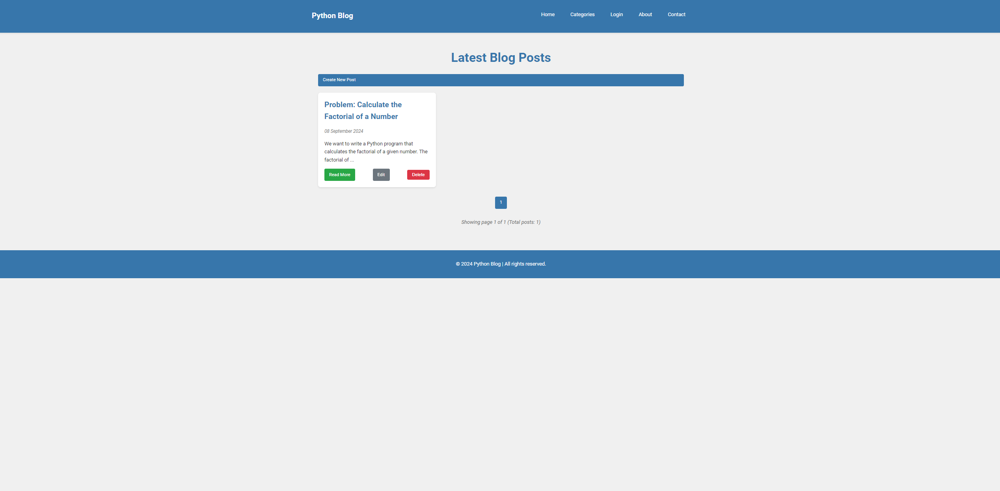

```markdown
# Python Blog



A dynamic blog application built with Flask, featuring user authentication, blog post creation, editing, and deletion.

## Table of Contents

- [Features](#features)
- [Technologies Used](#technologies-used)
- [Installation](#installation)
- [Usage](#usage)
- [Project Structure](#project-structure)
- [Screenshots](#screenshots)
- [Contributing](#contributing)
- [License](#license)

## Features

- User authentication (login/logout)
- Create, read, update, and delete blog posts
- Responsive design for various screen sizes
- Syntax highlighting for code snippets
- Pagination for blog posts
- Category-based post organization

## Technologies Used

| Technology    | Description                    |
| ------------- | ------------------------------ |
| Python 3.9+   | Core programming language      |
| Flask         | Web framework                  |
| SQLAlchemy    | ORM for database operations    |
| Flask-Login   | User session management        |
| Flask-Migrate | Database migration             |
| HTML/CSS      | Frontend structure and styling |
| JavaScript    | Client-side interactivity      |

### Python Libraries

- **Flask**: A micro web framework for Python.
- **Flask-SQLAlchemy**: Adds SQLAlchemy support to Flask.
- **Flask-Migrate**: Handles SQLAlchemy database migrations for Flask.
- **Flask-Login**: Provides user session management for Flask.
- **Werkzeug**: A comprehensive WSGI web application library.
- **Jinja2**: A modern and designer-friendly templating language for Python.

## Installation

1. Clone the repository:
```

git clone https://github.com/aytekinkaplan/my-python-blog.git
cd my-python-blog

```

2. Create a virtual environment:
```

python -m venv venv
source venv/bin/activate # On Windows use `venv\Scripts\activate`

```

3. Install the required packages:
```

pip install -r requirements.txt

```

4. Set up the database:
```

flask db upgrade

```

5. Run the application:
```

flask run

```

## Usage

After starting the server, navigate to `http://localhost:5000` in your web browser.

- Create an account or log in
- Create new blog posts
- Edit or delete your existing posts
- Browse posts by category

## Project Structure

```

my-python-blog/
│
├── app/
│ ├── static/
│ │ ├── css/
│ │ └── js/
│ ├── templates/
│ ├── **init**.py
│ ├── models.py
│ └── routes.py
│
├── migrations/
├── imagesofproject/
├── .gitignore
├── config.py
├── requirements.txt
└── run.py

```

## Screenshots

### Login Page


### Blog Post


## Contributing

Contributions are welcome! Please feel free to submit a Pull Request.

## License

This project is licensed under the MIT License - see the [LICENSE](LICENSE) file for details.
```
